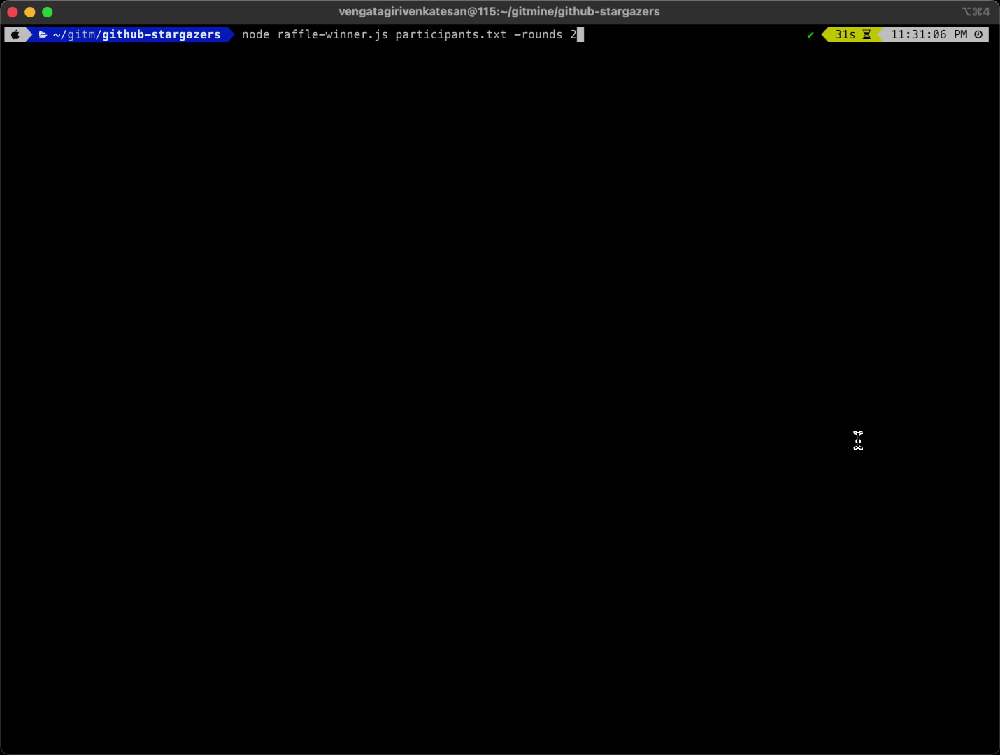

# GitHub Stargazers & Raffle System

A comprehensive Node.js project (terminal CLI tool) that combines GitHub stargazer analytics with an interactive cyberpunk-themed raffle system for selecting winners from your stargazers.

## 🚀 Project Overview

This project consists of two main components:

1. **GitHub Stargazers Analytics** (`github-stargazers.js`) - Fetches and analyzes stargazers from GitHub repositories
2. **Cyberpunk Raffle System** (`raffle-winner.js`) - An interactive, animated raffle system for selecting winners

   

## 📊 GitHub Stargazers Analytics

### Features
- **API Integration**: Fetches stargazer data from GitHub repositories
- **Configurable Repository**: Set target repository via environment variables
- **Rate Limiting**: Handles GitHub API rate limits gracefully
- **Authentication**: Supports both authenticated and unauthenticated requests
- **Data Export**: Generates JSON reports and summaries
- **Advanced Filtering**: Filter stargazers by date, time ranges, and timezone
- **Timezone Support**: Filter stargazers by specific timezones (UTC, regional, etc.)
- **Time Range Filtering**: Filter stargazers within specific time windows on a given date
- **Interactive Validation**: User confirmation for invalid timezones before processing
- **Optimized Pagination**: Efficient API usage with early termination
- **Enhanced Error Handling**: Comprehensive validation and user-friendly error messages

### Usage

#### Basic Usage
```bash
# Fetch all stargazers (requires GITHUB_TOKEN for private repos)
node github-stargazers.js

# Fetch with specific options
node github-stargazers.js --sort desc --limit 20

# Filter by specific date
node github-stargazers.js --date 2025-08-20

# Get just 5 most recent stargazers
node github-stargazers.js --limit 5
```

#### Advanced Time Filtering
```bash
# Filter stargazers by time range on a specific date
node github-stargazers.js --date 2025-02-26 --from 09:00 --to 17:00

# Filter with timezone support (UTC)
node github-stargazers.js --date 2025-02-26 --from 09:00 --to 17:00 --timezone UTC

# Filter with regional timezone (Eastern Time)
node github-stargazers.js --date 2025-02-26 --from 09:00 --to 17:00 --timezone America/New_York

# Filter with seconds precision
node github-stargazers.js --date 2025-02-26 --from 09:30:00 --to 18:30:00 --timezone Europe/London
```

#### Repository Configuration
```bash
# Set target repository via environment variables (optional)
export STARGAZERS_REPO_OWNER="your_org_or_username"
export STARGAZERS_REPO_NAME="your_repository_name"

# Default repository: SolaceLabs/solace-agent-mesh
# Examples:
export STARGAZERS_REPO_OWNER="nodejs"
export STARGAZERS_REPO_NAME="node"
```

#### Authentication Setup
```bash
# Set your GitHub token (required for private repos or higher rate limits)
export GITHUB_TOKEN="your_github_token_here"

# For organizations with SAML enforcement, authorize your token:
# 1. Go to https://github.com/settings/tokens
# 2. Find your token and click "Configure"
# 3. Grant access to the required organization
```

#### Command Line Options
- `--sort <asc|desc>`: Sort order (default: desc)
- `--limit <number>`: Maximum number of stargazers to fetch
- `--date <YYYY-MM-DD>`: Filter stargazers by specific date
- `--from <HH:MM[:SS]>`: Filter from time (requires --date and --to)
- `--to <HH:MM[:SS]>`: Filter to time (requires --date and --from)
- `--timezone <tz>`: Timezone for time filtering (if not specified, local timezone will be used)
- `--help`: Show help information

#### Time Filtering Rules
- **Time Range Required**: `--from` and `--to` must be used together
- **Date Required**: Time filtering requires `--date` parameter
- **Timezone Support**: Use standard IANA timezone identifiers
- **Time Formats**: Supports both `HH:MM` and `HH:MM:SS` formats
- **Local Default**: If no timezone specified, uses your machine's local timezone

#### Valid Timezone Examples
- `UTC` - Coordinated Universal Time
- `America/New_York` - Eastern Time (US)
- `America/Los_Angeles` - Pacific Time (US)
- `Europe/London` - British Time
- `Europe/Paris` - Central European Time
- `Asia/Tokyo` - Japan Standard Time
- `Asia/Shanghai` - China Standard Time

> **💡 Tip**: For a complete list of valid timezone identifiers, visit: https://en.wikipedia.org/wiki/List_of_tz_database_time_zones

### Output Files
- `stargazers-detailed.json`: Complete stargazer data with user profiles
- `stargazers-report.json`: Processed statistics and analytics
- `stargazers-summary-{timestamp}.json`: Summary with usernames and dates
- `participants.txt`: Generated from stargazer data for raffle system

### Enhanced Error Handling
The script now includes comprehensive validation and user-friendly error messages:

#### Validation Features
- **Unknown Options**: Detects and reports unknown command-line options
- **Invalid Parameters**: Validates parameter values and formats
- **Required Combinations**: Ensures `--from` and `--to` are used together
- **Parameter Dependencies**: Validates that time filtering requires date parameter
- **Timezone Validation**: Checks for valid timezone identifiers

#### Error Examples
```bash
# ❌ Invalid: Using --from without --to
node github-stargazers.js --date 2025-02-26 --from 09:00
# Error: --from and --to must be used together as a time range

# ❌ Invalid: Using time parameters without date
node github-stargazers.js --from 09:00 --to 17:00
# Error: --from and --to options can only be used with --date option

# ❌ Invalid: Unknown option
node github-stargazers.js --unknown-option
# Error: Unknown option '--unknown-option'

# ❌ Invalid: Invalid time format
node github-stargazers.js --date 2025-02-26 --from 25:00 --to 17:00
# Error: Invalid from time '25:00'. Must be HH:MM or HH:MM:SS format

# ⚠️ Interactive: Invalid timezone with user confirmation
node github-stargazers.js --date 2025-02-26 --from 09:00 --to 17:00 --timezone invalid
# Warning: Unknown timezone 'invalid'
#    This will fall back to local timezone (Asia/Calcutta)
# Do you want to proceed with local timezone? (y/N):
```

### Interactive Timezone Validation
The script now includes interactive validation for invalid timezones:

#### How It Works
1. **Early Detection**: Invalid timezones are detected before any processing begins
2. **User Confirmation**: Script asks for confirmation before proceeding
3. **Clear Information**: Shows the invalid timezone and fallback timezone
4. **User Control**: User can choose to proceed or cancel the operation

#### Example Flow
```bash
$ node github-stargazers.js --date 2025-02-26 --from 09:00 --to 17:00 --timezone invalid

⚠️  Warning: Unknown timezone 'invalid'
   This will fall back to local timezone (Asia/Calcutta)

Do you want to proceed with local timezone? (y/N): y
✅ Proceeding with local timezone...
🚀 GitHub Stargazers Fetcher
...
```

### Rate Limits
- **Unauthenticated**: 60 requests/hour
- **Authenticated**: 5,000 requests/hour
- **SAML Organizations**: Requires token authorization

## 🎲 Cyberpunk Raffle System

### Features
- **Interactive Animation**: Cyberpunk-themed terminal animations
- **ASCII Art Display**: Beautiful ASCII art for winner names
- **Configurable Rounds**: Customizable number of elimination rounds
- **Winner Tracking**: Saves winners to prevent duplicate selections
- **Frame-based UI**: Terminal frame with cyberpunk styling
- **Confetti Animation**: Celebratory animations for winners

### Usage

> **💡 Pro Tip**: For the best experience, run the raffle system in a full-screen terminal window. The cyberpunk animations and ASCII art display work best with maximum terminal space.

#### Basic Usage
```bash
# Run raffle with default settings (3 rounds)
node raffle-winner.js participants.txt

# Run with custom number of rounds
node raffle-winner.js participants.txt -rounds 5

# Interactive mode (press ENTER between stages)
node raffle-winner.js participants.txt -interactive

# Combine options
node raffle-winner.js participants.txt -rounds 1 -interactive
```

#### Command Line Options
- `-rounds <number>`: Number of elimination rounds (default: 3)
- `-interactive`: Wait for key press between stages
- `participants.txt`: File containing participant names (one per line)

#### Participants File Format
Create a `participants.txt` file with one participant name per line. This can be:

**Option 1: Direct output from GitHub Stargazers script**

**Option 2: Custom file with participant names**
```
Alice Johnson
Bob Smith
Charlie Brown
Diana Prince
Eve Wilson
```

**Note**: The file can be either a direct output from the github-stargazers script (containing GitHub usernames) or a custom file with a list of names (newline-separated list).

### Raffle Process
1. **Welcome Animation**: Cyberpunk-themed introduction
2. **Statistics Display**: Shows total participants and previous winners
3. **Elimination Rounds**: Progressive elimination with animations
4. **Final Countdown**: Dramatic countdown to winner selection
5. **Confetti Celebration**: Animated celebration with winner display
6. **ASCII Art Winner**: Beautiful ASCII art display of winner name

### Winner Tracking
- Winners are automatically saved to `raffle-winners.json`
- Previous winners are excluded from future raffles
- Option to reset the raffle when all participants have won

### Animation Features
- **Cyberpunk Wheel**: Spinning wheel animation during selection
- **Neural Scan**: Sci-fi themed scanning animations
- **Elimination Effects**: Progressive elimination with visual feedback
- **Confetti Burst**: Celebratory particle effects
- **ASCII Art**: Custom ASCII art generation for winner names

## 🛠️ Installation & Setup

### Prerequisites
- Node.js (v14 or higher)
- GitHub Personal Access Token (for stargazers analytics)

### Installation
```bash
# Clone or download the project
git clone <repository-url>
cd github-stargazers

# No additional dependencies required - uses only Node.js built-ins
```

### Environment Setup
```bash
# Set GitHub token for stargazers analytics
export GITHUB_TOKEN="your_github_token_here"

# Set target repository (optional - defaults to SolaceLabs/solace-agent-mesh)
export STARGAZERS_REPO_OWNER="your_org_or_username"
export STARGAZERS_REPO_NAME="your_repository_name"

# Create participants file for raffle
echo "Participant 1" > participants.txt
echo "Participant 2" >> participants.txt
echo "Participant 3" >> participants.txt
```

## 📁 Project Structure

```
github-stargazers/
├── README.md                    # This file
├── github-stargazers.js         # Main stargazers analytics script
├── raffle-winner.js            # Cyberpunk raffle system
├── github-stargazers-setup.md  # Detailed setup guide
├── participants.txt            # Raffle participants (create this)
├── raffle-winners.json         # Generated: raffle winners
├── stargazers-detailed.json    # Generated: detailed stargazer data
├── stargazers-report.json      # Generated: analytics report
└── stargazers-summary-*.json   # Generated: timestamped summaries
```

## 🎯 Use Cases

### For Open Source Projects
- **Community Engagement**: Track and reward your stargazers
- **Analytics**: Understand your project's growth and engagement
- **Rewards**: Run raffles to give back to your community
- **Time-based Analysis**: Analyze stargazer patterns during specific events or announcements
- **Global Reach**: Filter stargazers by timezone to understand international engagement
- **Multi-Repository Analysis**: Analyze stargazers from different repositories using environment variables

### For Organizations
- **Team Building**: Use raffles for internal team events
- **Community Management**: Engage with your GitHub community
- **Data Analysis**: Analyze stargazer patterns and trends
- **Business Hours Analysis**: Filter stargazers during business hours in specific timezones
- **Event Impact**: Measure the impact of announcements or releases by time

### For Events & Contests
- **Conference Giveaways**: Select winners from event participants
- **Hackathon Prizes**: Fair selection of contest winners
- **Community Rewards**: Reward active community members
- **Time-limited Contests**: Filter participants who engaged during specific contest periods
- **Global Events**: Analyze participation across different timezones for international events

## 🔧 Customization

### Stargazers Analytics
- Set `STARGAZERS_REPO_OWNER` and `STARGAZERS_REPO_NAME` environment variables
- Adjust rate limiting and pagination settings
- Customize output formats and data processing
- Modify timezone validation and confirmation behavior

### Raffle System
- Modify ASCII art characters in `createSmallAsciiArt()`
- Adjust animation timings and delays
- Customize cyberpunk themes and colors
- Add new elimination round types

## 🐛 Troubleshooting

### Common Issues

#### GitHub API Rate Limits
```bash
# Error: API rate limit exceeded
# Solution: Wait for rate limit reset or use authenticated requests
export GITHUB_TOKEN="your_token_here"
```

#### SAML Enforcement
```bash
# Error: Resource protected by organization SAML enforcement
# Solution: Authorize your token for the organization
# Go to https://github.com/settings/tokens and configure organization access
```

#### Raffle File Not Found
```bash
# Error: File not found: participants.txt
# Solution: Create the participants file
echo "Participant Name" > participants.txt
```

## 📈 Performance

### Stargazers Analytics
- **Optimized Pagination**: Stops early when limit reached
- **Batch Processing**: Efficient API usage with delays
- **Memory Efficient**: Processes data in chunks

### Raffle System
- **Smooth Animations**: 60fps terminal animations
- **Responsive UI**: Adapts to terminal size
- **Fast Execution**: Minimal delays for quick results

## 🤝 Contributing

1. Fork the repository
2. Create a feature branch
3. Make your changes
4. Test thoroughly
5. Submit a pull request

## 📄 License

This project is open source and available under the MIT License.

## 🎉 Acknowledgments

- GitHub API for providing stargazer data
- Node.js community for excellent documentation
- All the stargazers who make open source projects thrive!

---

**Happy Raffling! 🎲✨**
